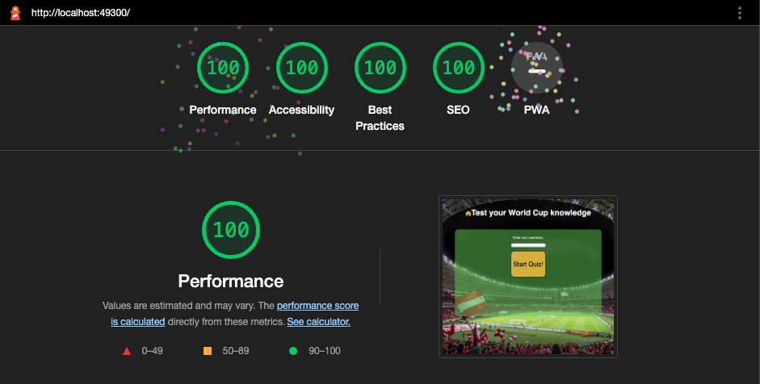

# World Cup Quiz

## Introduction

World Cup Quiz is a time-based quiz game taken as inspiration from this years FIFA World Cup. The game contains multiple choice questions, with a 15 second limit per question. 

The interactive code was developed in Javascript and the interface was developed in HTML and CSS.

<a href="https://macker85.github.io/World-Cup-Quiz/" rel="nofolow">Play World Cup Quiz</a>

## Table of Contents

- [World Cup Quiz](#World-Cup-Quiz)
  - [Introduction](#introduction)
  - [Table of Contents](#table-of-contents)
  - [Design](#design)
    - [Color Scheme](#color-scheme)
    - [Wireframe](#wireframe)
  - [Technologies](#technologies)
  - [User Stories](#user-stories)
  - [Features](#features)
    - [Welcome Section](#welcome-section)
    - [Choose Game Screen](#choose-game-screen)
    - [Rules Menu](#how-to-play-screen)
    - [Question Screen](#Question-screen)
    - [Correct/Incorrect Answer Screen](#Correct/Incorrect-answer-screen)
    - [Timeout Screen](#timeout-screen)
    - [Game over Screen](#game-over-screen)
  - [Testing](#testing)
  - [Resolved Bugs](#resolved-bugs)
  - [Unresolved Bugs](#unresolved-bugs)
  - [Features I would like to Implement](#features-I-would-like-to-implement)
  - [Deployment](#deployment)
  - [Cloning](#cloning)
  - [Forking](#forking)
  - [Credits](#credits)
 
## Design

This game was designed to play with a competitive feel with the background images drawing out this sense and also that it is effective on most screen sizes, the colours were chosen to support the theme of the game being the World Cup with gold for the cup and green for a football pitch.

The game is designed with clear distinction for interactive elements via color scheme & hover effects, making it easier for the user to navigate the site and have a familiar feel to the format.

I also designed the site with my previous project in mind so that I might link them in the future.

### Color Scheme

The colors I choose were more in support of the background image and the main question area was left with some oppacity to ensure that it wasn't lost. The gold is to link in with the world cup trophy and the black to make it really stand out.

### Wireframe

Due to the straightforward design there was very little media queries needed to make this site adaptable to smaller screens, the wireframing is similar across larger screens and the 2 breakpoints I found.

The wireframes are not exactly the same as the finished product but I felt it was good to show where I was going versus where I ended up.

## Technologies

The technologies used in this project were HTML, CSS and JavaScript. 

- HTML5
- CSS3
- JavaScript
- GitHub
- [Am I Responsive](http://ami.responsivedesign.is/) to test responsiveness

## User Stories

### As a user I want to:
  - 1.Have a clear idea what to expect from this quiz.
  - 2.Enter my name and have it appear throughout the quiz.
  - 3.Activate the quiz when I am ready.
  - 4.Ansnwer questions related to the world cup.
  - 5.Have a way to navigate back to the start if I wish to start again.
  - 6.Know how much time I have for the question and how many questions I will be asked.
  - 7.See my final score and have the option to play again to beat it.

## Features

### Header - User story 1

The header clarifies for the user what to expect and will be consistant on each part of the quiz.

It provides the user with a breif description of the game, and will also act as a navbar, this will bring the user back to the start of the quiz if they wish and the cursor will change to show a clickable option. I also added a home icon which is also clickable to support the message.

### Enter name - User story 2

This will allow you to enter your name and have it appear throughout the quiz making it a more personal experience.

### Start button - User story 3

The how to play screen provides the user with the guidelines of the game, along with a button to return to the welcome screen.

### Question screen - User story 4

The question screen will show your current question, remaining questions amount and progres so far.

### Timer - User story 6

The timer will show a count of seconds passing and also a progress bar for how much time is left.

### Final score % with animation - User story 7

This screen will appear after the questions have been answered with 3 different animated gifs depending on your score. Your score will also show up as a percentage.

### Play again button

This button will bring the user back to the start so they can take the quiz again.

## Testing

This website was tested in the following instances:
 <ul>
<li>MacBook Air running Google Chrome, FireFox and Safari</li>
<li>Android smartphone running Google Chrome Version</li>
<li>iPhone running Safari</li>
</ul>

W3C CSS Validation:

 W3C HTML Validation:

Jshint validator was used to validate the JavaScript code.

Showing no errors for either JavaScript file.

Lighthouse score:

## Resolved Bugs

| Bug        | Resolution      |     
| ------------- |:-------------|
| Link questions JavaScript to script JavaScript not reading | Change file from .js to .mjs and export questions as 'Const' | 
| Progress bar and timer not showing on lauched screen | Typo in HTML |
| Timer loading on start screen | Set display to none in HTML and load display as block in JS when rendering start quiz      | 
| Score image not loading apon completion      | File path fixed |
| Timer not centering in screen      | Set margin to auto |

## Features I would like to implement

- Randomise questions to add incentive to replay
- Add sounds
- A leaderboard to make it more competitive

## Deployment 
This website is deployed to GitHub.
To deploy to GitHub, I completed the following steps
1. Login to [GitHub](https://github.com/)
2. Find the relevant repo, which is in this case ['World-Cup-Quiz'](https://github.com/Macker85/World-Cup-Quiz)
3. Go to the repository settings, and within here select 'pages'
5. Select `main` in the Source drop down box below the 'Build and deployment' title and click save.
6. Wait for the live site to become active. Upon reloading a link will appear for the site

## Cloning
1. On GitHub.com, navigate to the main page of the repository which is ['here'](https://github.com/Macker85/World-Cup-Quiz)
2. Above the list of files, click  Code.
3. Copy the URL for the repository.
4. Open Git Bash.
5. Change the current working directory to the location where you want the cloned directory.
6. Type git clone, and then paste the URL you copied earlier.
7. Press Enter to create your local clone.

## Forking
1. Login or signup to [GitHub](https://github.com/)
2. Find the relevant repo, which is in this case ['World-cup-Quiz'](https://github.com/Macker85/World-Cup-Quiz)
3. Click on the 'Fork' button in the upper left.
4. A forked version of this repo will be generated.

## Credits

### Media

- Background image - Pixaby
- Gif first-place - tenor.com
- Gif second-place - Gifer.com
- Gif third-place - tenor.com

### Acknowledgements

- The ilumni on Slack
- Jack, my mentor
- Code Explained - YouTube videos
- Brian design - YouTube videos
- BroCode - YouTube videos
- W3schools.com
- Stack Overflow